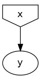

Simulate data for a simple linear regression problem
=========================================================================

In this tutorial, you will learn how to build a simple DAG using DagSim to generate data for a simple linear regression problem. If you are not familiar with the workflow of DagSim, see :ref:`How to specify a simulation`.
We begin by importing the following:

.. highlight:: python
.. code-block:: python

  from baseDS import Graph, Generic
  import numpy as np
  from sklearn.linear_model import LinearRegression as lr
  import pandas as pd

1. **Defining the functions:**

The first thing that we need to define is the functions that relate the nodes to each other. In our example, we need one function for simulating the value of the feature :math:`x` and another function to specify the true relation between :math:`x` and the output :math:`y`. 

For simplicity, we will simulate x to follow a standard normal distribution. For :math:`y`, suppose that the ground truth relation is:
:math:`y = 2x + 1 + \epsilon`, where :math:`\epsilon` is a white noise error term . Suppose that we also want to have control of the standard deviation of this error term from DagSim.

We can then define such a function in python as the following:

.. highlight:: python
.. code-block:: python

  def ground_truth(x, add_param):
    y = 2 * x + 1 + np.random.normal(0, add_param)
    return y
    
This function would inform DagSim how to simulate the value :math:`y` for each value of :math:`x`.

2. **Defining the graph:**

For the node of the variable :math:`x` we only need to give it a name and the function to evaluate. This is because it has no parents, i.e. it is a root node, and the function to evaluate :math:`x` does not need any arguments in our case. For the node of the variable :math:`y`, we need to give it a name, the function to evaluate, and the values of the arguments needed to evaluate that function. The latter is given as a dictionary where the keys are the names of the function arguments, and each value is either another node or an object of the correct data type for the corresponding argument.

.. highlight:: python
.. code-block:: python

  Nodex = Generic(name="x", function=np.random.normal)
  Nodey = Generic(name="y", function=ground_truth, arguemnts={"x": Nodex, "add_param": 1})
  
At this stage we can simply compile the graph as follows:
    
.. highlight:: python
.. code-block:: python

  listNodes = [Nodex, Nodey]
  my_graph = Graph("Graph1", listNodes)
  
Once we have compiled the graph, we can draw it to get a graphical representation of the underlying model:

.. highlight:: python
.. code-block:: python

  my_graph.draw()

3. **Running the simulation:**

Now that we have defined everything we need, we simulate the data by calling the :code:`simulate` method and providing the number of samples and the name of the CSV file to which to save the data. We will run two simulations using the same model, one for training data and another for testing data.

.. highlight:: python
.. code-block:: python

  train = my_graph.simulate(num_samples=70, csv_name="train")
  test = my_graph.simulate(num_samples=30, csv_name="test")
  
4. **Running the analysis:**

Here, we will use the linear regression model by :code:`scikit-learn` to run the analysis, and :code:`pandas` to read the CSV files. Note that this step is not DagSim-specific and is up to the user to define the workflow of the analysis. We can use the dictionary returned by the :code:`simulate` method, which contains the data, or read the saved CSV files. Here, we will use the second method.

First, we need to read the training dataset in order to train the model:

.. highlight:: python
.. code-block:: python 

  train_data = pd.read_csv("train.csv")
  print(train_data.head())

  x_train = train_data.iloc[:, 0].to_numpy().reshape([-1, 1])
  print("x_train", x_train.shape)
  y_train = train_data.iloc[:, 1].to_numpy().reshape([-1, 1])
  print("y_train", y_train.shape)
  
After that we train a linear regression model as follows:

.. highlight:: python
.. code-block:: python 

  LR = lr()
  reg = LR.fit(x_train, y_train)
  reg.score(x_train, y_train)
  print("Coefficient: ", LR.coef_)
  print("Intercept: ", LR.intercept_)
  
Now, we evaluate the model by first reading the testing data set, and then calculating the :math:`R^2` coefficient:

.. highlight:: python
.. code-block:: python 

  test_data = pd.read_csv("test.csv")
  x_test = test_data.iloc[:, 0].to_numpy().reshape([-1, 1])
  print("x_test", x_test.shape)
  y_test = test_data.iloc[:, 1].to_numpy().reshape([-1, 1])
  print("y_test", y_test.shape)
  print("R2 score on test data: ", LR.score(x_test, y_test))
  
The complete code can be found on GitHub.
